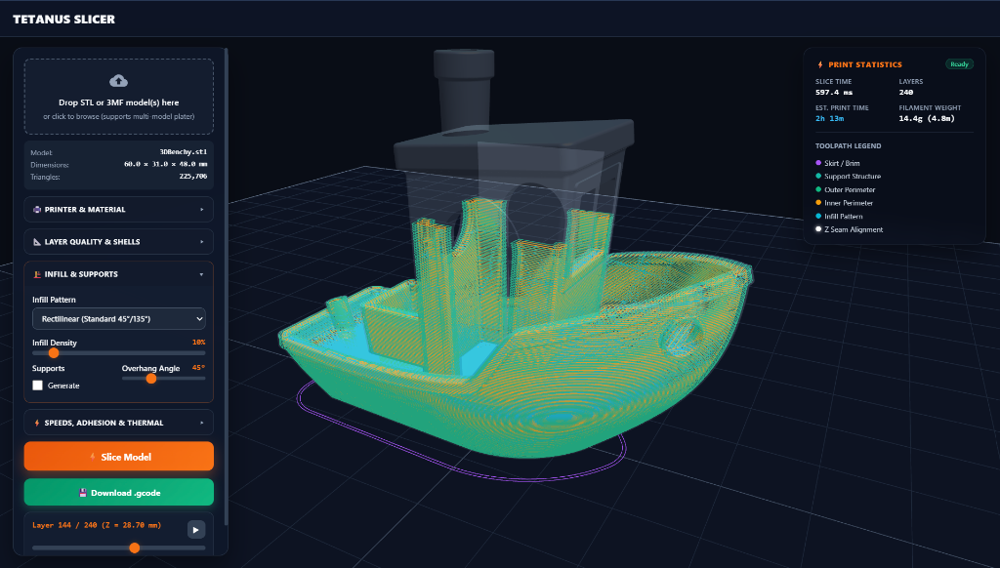

# Tetanus Slicer

A high-performance, multi-threaded 3D slicing engine and interactive Web GUI written in pure Rust.



---

## Highlights & Capabilities

* **Multi-Threaded Rayon Architecture**: Slices layers concurrently across all CPU threads with near-instant slice times (e.g., standard 3DBenchy slices in ~600 ms).
* **Spatial Z-Interval Acceleration**: Reduces triangle-plane intersection queries from $\mathcal{O}(N \times L)$ to $\mathcal{O}(\log N + K)$.
* **Native STL & 3MF Parser**: Supports both ASCII and Binary STL as well as compressed 3MF formats with automatic unit normalization and bounds detection.
* **Modern Web GUI & 3D Viewport**:
  * Clean Three.js orbital 3D workspace with dark theme and build plate grid.
  * Drag-and-drop file ingestion supporting single and multi-model build plate layouts.
  * Real-time automatic background slicing upon model drop or setting changes with debounce.
  * Top-right ghosted **Print Statistics HUD** with live slice duration, total layers, estimated print time, and filament weight (grams & length).
  * Color-coded **Toolpath Legend**:
    * 🟣 Skirt / Brim
    * 🟢 Outer Perimeter
    * 🟠 Inner Perimeter
    * 🔷 Infill (Rectilinear, Grid, Triangles, Gyroid)
    * 🔹 Support Structure
    * ⚪ Z-Seam alignment indicators
  * Interactive layer scrubber with single-layer isolator, accumulated buildup mode, and playback controls.
  * One-click `.gcode` export.
* **Advanced Infill Patterns**:
  * **Rectilinear**: Alternating 45°/135° scanlines.
  * **Grid**: Bi-directional crosshatch grid.
  * **Triangles**: Isotropic rigidity infill.
  * **3D Gyroid**: Continuous sinusoidal non-planar infill with progressive Z-axis phase evolution.
* **Specialized Print Modes**:
  * **Spiral Vase Mode**: Seamless continuous single-wall spiralized outer perimeter with zero seams.
  * **Adaptive Layer Heights**: Slope-aware layer thickness (0.08 mm to 0.28 mm) for optimal curved surface fidelity and fast vertical walls.
  * **Z-Seam Management**: Aligned (convex corner optimization), Rear (+Y bed), Nearest (minimal travel), and Random.
  * **Overhang Supports**: Automatic overhang angle detection and dedicated support toolpath generation.
* **Machine & Material Profiles**: Cascading profile architecture with presets for printers (e.g. Bambu Lab A1, Generic Cartesian) and materials (PLA, PETG).

---

## Quick Start

### Prerequisites
* Rust toolchain (1.70+ recommended): `cargo`

### Build
```bash
cargo build --release
```

### Web GUI Mode (Interactive 3D Slicer)
Run the built-in web server:
```bash
./target/release/tetanus-slicer --web
```
Or specify a custom port:
```bash
./target/release/tetanus-slicer --web --port 8080
```
Open **`http://localhost:8080`** in your browser. Drag and drop any `.stl` or `.3mf` file directly into the viewport to begin slicing!

---

### CLI Mode

Slice directly from the command line:
```bash
./target/release/tetanus-slicer path/to/model.stl output.gcode \
  --layer-height 0.20 \
  --perimeters 2 \
  --infill 0.15 \
  --infill-pattern gyroid \
  --machine bambu_a1 \
  --filament pla
```

If run without arguments, it generates a calibration cube and slices it automatically:
```bash
./target/release/tetanus-slicer
```

---

## CLI Options

| Flag / Option | Description | Default |
|---|---|---|
| `-w`, `--web` | Launch the embedded interactive Web GUI server | `false` |
| `--port <n>` | Port for the Web GUI server | `8080` |
| `--layer-height <mm>` | Primary layer height | `0.20` |
| `--perimeters <n>` | Number of perimeter shells | `2` |
| `--infill <float>` | Infill density ratio (0.0 to 1.0) | `0.20` |
| `--infill-pattern <name>` | Infill type (`rectilinear`, `grid`, `triangles`, `gyroid`) | `rectilinear` |
| `--machine <name>` | Machine profile (`bambu_a1`, `generic_cartesian`) | `bambu_a1` |
| `--filament <name>` | Filament profile (`pla`, `petg`) | `pla` |
| `--spiral-vase` | Enable spiral vase mode | `false` |
| `--adaptive-layers` | Enable slope-dependent adaptive layer heights | `false` |
| `--support` | Enable overhang support structure generation | `false` |
| `--support-angle <deg>` | Overhang threshold angle | `45` |

---

## License

MIT / Apache-2.0
